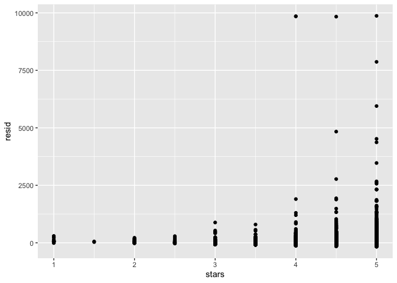
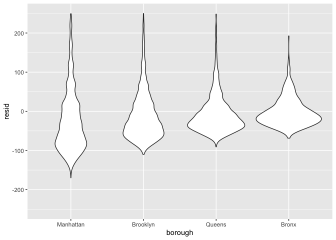

Linear Models
================
2022-11-10

## Model fitting

Let’s load the airbnb data.

``` r
data("nyc_airbnb")

nyc_airbnb = 
  nyc_airbnb %>% 
  mutate(stars = review_scores_location / 2) %>% 
  rename(
    borough = neighbourhood_group,
    neighborhood = neighbourhood) %>% 
  filter(borough != "Staten Island") %>% 
  select(price, stars, borough, neighborhood, room_type)
```

An good place to start is to consider price as an outcome that may
depend on rating and borough. We fit that initial model in the following
code.

``` r
fit = lm(price ~ stars + borough, data = nyc_airbnb)
```

The `lm` function begins with the formula specification – outcome on the
left of the `~` and predictors separated by `+` on the right. As we’ll
see shortly, interactions between variables can be specified using `*`.
You can also specify an intercept-only model (`outcome ~ 1`), a model
with no intercept (`outcome ~ 0 + ...`), and a model using all available
predictors (`outcome ~ .`).

R will treat categorical (factor) covariates appropriately and
predictably: indicator variables are created for each non-reference
category and included in your model, and the factor level is treated as
the reference. As with `ggplot`, being careful with factors is therefore
critical!

``` r
nyc_airbnb = 
  nyc_airbnb %>% 
  mutate(
    borough = fct_infreq(borough),
    room_type = fct_infreq(room_type))

fit = lm(price ~ stars + borough, data = nyc_airbnb)
```

## Tidying output

The output of a `lm` is an object of class `lm` – a very specific list
that isn’t a dataframe but that can be manipulated using other
functions. Some common functions for interacting with lm fits are below,
although we omit the output.

``` r
summary(fit$coefficients) #Not great
summary(fit)
summary(fit)$coef
coef(fit)
fitted.values(fit)
```

We can tidy our model output into a clean dataframe. The `broom` package
has functions for obtaining a quick summary of the model and for
cleaning up the coefficient table.

``` r
fit %>% 
  broom::glance()
```

    ## # A tibble: 1 × 12
    ##   r.squared adj.r.…¹ sigma stati…²   p.value    df  logLik    AIC    BIC devia…³
    ##       <dbl>    <dbl> <dbl>   <dbl>     <dbl> <dbl>   <dbl>  <dbl>  <dbl>   <dbl>
    ## 1    0.0342   0.0341  182.    271. 6.73e-229     4 -2.02e5 4.04e5 4.04e5  1.01e9
    ## # … with 2 more variables: df.residual <int>, nobs <int>, and abbreviated
    ## #   variable names ¹​adj.r.squared, ²​statistic, ³​deviance

``` r
fit %>% 
  broom::tidy() %>% 
  mutate(
    term = str_replace(term, "borough", "Borough: ")
  ) %>% 
  select(term, estimate, p.value) %>% 
  knitr::kable(digits = 2)
```

| term              | estimate | p.value |
|:------------------|---------:|--------:|
| (Intercept)       |    19.84 |     0.1 |
| stars             |    31.99 |     0.0 |
| Borough: Brooklyn |   -49.75 |     0.0 |
| Borough: Queens   |   -77.05 |     0.0 |
| Borough: Bronx    |   -90.25 |     0.0 |

Category 1 is the reference category in regression! Let’s change the
reference category…R will automatically level categorical factors in
alphabetical order, but we want to set the reference level to the most
frequent observed category.

Note how we use pipes in `lm` - it expects a formula first and a
dataframe second. If the first argument isn’t a dataframe, we have to
specify where it goes using `.`

``` r
fit = nyc_airbnb %>% 
  mutate(
    borough = fct_infreq(borough),
    room_type = fct_infreq(room_type)) %>% 
  lm(price ~ stars + borough, data = .) 

fit %>% 
  broom::tidy() %>% 
  mutate(
    term = str_replace(term, "borough", "Borough: ")
  ) %>% 
  select(term, estimate, p.value) %>% 
  knitr::kable(digits = 2)
```

| term              | estimate | p.value |
|:------------------|---------:|--------:|
| (Intercept)       |    19.84 |     0.1 |
| stars             |    31.99 |     0.0 |
| Borough: Brooklyn |   -49.75 |     0.0 |
| Borough: Queens   |   -77.05 |     0.0 |
| Borough: Bronx    |   -90.25 |     0.0 |

``` r
fit %>% 
  broom::glance() %>% 
  select(AIC)
```

    ## # A tibble: 1 × 1
    ##       AIC
    ##     <dbl>
    ## 1 404237.

As an aside, `broom::tidy` works with lots of things, including most of
the functions for model fitting you’re likely to run into (survival,
mixed models, additive models, …).

## Diagnostics

We want to get residuals from the model we just fit and plot them.

``` r
modelr::add_residuals(nyc_airbnb, fit) %>% 
  ggplot(aes(x = stars, y = resid)) + 
  geom_point()
```

<!-- -->

These residuals don’t look very random…there is way more variance for
stars 4-5 versus 1-2. If we want to do hypothesis testing, we may worry
about non-constant variance.

``` r
nyc_airbnb %>% 
  modelr::add_residuals(fit) %>% 
  ggplot(aes(x = borough, y = resid)) +
  geom_violin() + 
  ylim(-250, 250)
```

<!-- -->

Assumptions for constant variance aren’t met but the sample size is big.
There are a few things we might try to do here – including creating a
formal rule for the exclusion of outliers, transforming the price
variable (e.g. using a log transformation), or fitting a model that is
robust to outliers.

## Hypothesis testing

One coefficient (let’s say `stars`):

``` r
fit %>% 
  broom::tidy()
```

    ## # A tibble: 5 × 5
    ##   term            estimate std.error statistic   p.value
    ##   <chr>              <dbl>     <dbl>     <dbl>     <dbl>
    ## 1 (Intercept)         19.8     12.2       1.63 1.04e-  1
    ## 2 stars               32.0      2.53     12.7  1.27e- 36
    ## 3 boroughBrooklyn    -49.8      2.23    -22.3  6.32e-109
    ## 4 boroughQueens      -77.0      3.73    -20.7  2.58e- 94
    ## 5 boroughBronx       -90.3      8.57    -10.5  6.64e- 26

``` r
fit_null = lm(price ~ stars, data = nyc_airbnb) # Intercept and stars
fit_alt = lm(price ~ stars + borough, data = nyc_airbnb) #Intercept and 2 variables

anova(fit_null, fit_alt) %>% 
  broom::tidy()
```

    ## # A tibble: 2 × 7
    ##   term                    df.residual       rss    df   sumsq stati…¹    p.value
    ##   <chr>                         <dbl>     <dbl> <dbl>   <dbl>   <dbl>      <dbl>
    ## 1 price ~ stars                 30528    1.03e9    NA NA          NA  NA        
    ## 2 price ~ stars + borough       30525    1.01e9     3  2.53e7    256.  7.84e-164
    ## # … with abbreviated variable name ¹​statistic

Note that this works for *nested* models only. Comparing non-nested
models is a common problem that requires other methods; we’ll see one
approach in cross validation.

# Room type by borough

Interactions…?

``` r
fit = 
  nyc_airbnb %>% 
  lm(price ~ stars + borough * room_type, data = .)

fit %>% 
  broom::tidy()
```

    ## # A tibble: 13 × 5
    ##    term                                  estimate std.error statistic  p.value
    ##    <chr>                                    <dbl>     <dbl>     <dbl>    <dbl>
    ##  1 (Intercept)                              121.      11.8      10.3  1.01e-24
    ##  2 stars                                     21.8      2.42      8.97 3.06e-19
    ##  3 boroughBrooklyn                          -55.5      2.94    -18.9  2.81e-79
    ##  4 boroughQueens                            -86.7      5.66    -15.3  1.09e-52
    ##  5 boroughBronx                            -108.      14.9      -7.27 3.78e-13
    ##  6 room_typePrivate room                   -125.       2.99    -41.7  0       
    ##  7 room_typeShared room                    -154.       8.69    -17.7  9.81e-70
    ##  8 boroughBrooklyn:room_typePrivate room     32.4      4.31      7.51 5.97e-14
    ##  9 boroughQueens:room_typePrivate room       56.0      7.44      7.52 5.60e-14
    ## 10 boroughBronx:room_typePrivate room        71.6     18.0       3.98 7.03e- 5
    ## 11 boroughBrooklyn:room_typeShared room      48.1     13.9       3.46 5.34e- 4
    ## 12 boroughQueens:room_typeShared room        60.7     17.9       3.40 6.72e- 4
    ## 13 boroughBronx:room_typeShared room         85.4     42.4       2.01 4.41e- 2

## Nesting data

So…can we fit models by borough? (fit models within a dataframe for each
borough?) YES, with `map`!

``` r
nest_lm_res =
  nyc_airbnb %>% 
  nest(data = -borough) %>% 
  mutate(
    models = map(data, ~lm(price ~ stars + room_type, data = .x)),
    results = map(models, broom::tidy)) %>% 
  select(-data, -models) %>% 
  unnest(results)
```

Quick double check…?

``` r
nyc_airbnb %>% 
  filter(borough == "Bronx") %>% #Change borough name
  lm(price ~ stars + room_type, data = .) %>% 
  broom::tidy()
```

    ## # A tibble: 4 × 5
    ##   term                  estimate std.error statistic  p.value
    ##   <chr>                    <dbl>     <dbl>     <dbl>    <dbl>
    ## 1 (Intercept)              90.1      15.2       5.94 5.73e- 9
    ## 2 stars                     4.45      3.35      1.33 1.85e- 1
    ## 3 room_typePrivate room   -52.9       3.57    -14.8  6.21e-41
    ## 4 room_typeShared room    -70.5       8.36     -8.44 4.16e-16

What if we wanted all these boroughs at the same time?

``` r
nest_lm_res %>% 
  select(borough, term, estimate) %>% 
  mutate(term = fct_inorder(term)) %>% 
  pivot_wider(
    names_from = term, values_from = estimate) %>% 
  knitr::kable(digits = 3)
```

| borough   | (Intercept) |  stars | room_typePrivate room | room_typeShared room |
|:----------|------------:|-------:|----------------------:|---------------------:|
| Bronx     |      90.067 |  4.446 |               -52.915 |              -70.547 |
| Queens    |      91.575 |  9.654 |               -69.255 |              -94.973 |
| Brooklyn  |      69.627 | 20.971 |               -92.223 |             -105.839 |
| Manhattan |      95.694 | 27.110 |              -124.188 |             -153.635 |
